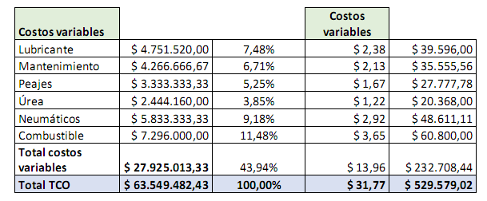

```{r setup, include=FALSE}
knitr::opts_chunk$set(echo = FALSE)
```

## Diplomatura Universitaria

**Gestión y Tecnologíaspara el desarrollo Convencional y No Convencional**

### Ejemplo de TCO


## Empresa de transporte terrestre 

**El análisis de los costos se enfocaría en ciertas perspectivas básicas, a saber:** 

* Determinar el costo por km recorrido. 

* Precisar los recursos de costos que provocarían posibles asimetrías en los mismos. 

* Identificar variables previsionales o tributarias que puedan impactar en los costos  de uso de estos vehículos. (Podmoguilnye, 2005) 

## **Se evalúan los costos directos del transportista con respecto a:**

* Los costos correspondientes a los usuarios en general del servicio de transporte 

* Los costos externos 

* Los costos sociales en su totalidad

A su vez, los costos se diferenciarían en fijos y variables, precisando una función del 
costo total teniendo en cuenta variables tales como: 
 
    COSTO TOTAL = CFIJO + (CFV * NC) + (CPK * KM) + (CCAR * tn) + (CVJ*NV) 
 

## El enfoque TCO 
se posiciona en un momento vinculado con el bien durable; en la mayoría de los casos en el de la evaluación de la inversión del mismo, teniendo en cuenta las variables que nos permitirían calcular el costo total colectivo y  asociarlo con la adquisición y el funcionamiento operativo de estos recursos, proyectándolo, con esta finalidad, a los distintos momentos de la vida útil del bien. 


## El TCO sería el resultante de :
 **A + F + M + I + O – R** 
 {width="100%"}


## Variables a tener en cuenta 
El TCO es una técnica de gestión de costos que ha  sido diseñada para ayudar a la identificación y determinación de los costos directos e 
indirectos, así como los beneficios relacionados con un bien durable o sistema.Se deberían ser considerados variables tales como: 
* Depreciación 

* Seguro 

* Patente y tasas 

* Financiación  

* Impuestos 

* Mantenimiento 

* Combustible 


## TCO de un vehículo para transporte de carga 

{width="100%"}


## Continuacion del cuadro
 
 {width="100%"}
## Software

Los software vinculados con TCO permiten ir modificando estas variables en función de su combinación y arrojan informes de los diferentes costos totales
de propiedad para  diferentes escenarios propuestos. En este ejemplo, la incorporación del PCS provoca un  descenso marcado en los días de inactividad de
la unidad por fallas en la conducción y  en el tratamiento del vehículo. Si descartáramos su utilización, no tendríamos el costo  del PCS pero se
dispararía el costo de inactividad. La facilidad de parametrización nos permitiría construir diferentes escenarios en la etapa previa a la inversión. 

## Costos calculados con TCO

{width="100%"}
## Visualización de los costos fijos del TCO 

{width="100%"}


## Costos variables y totales del TCO

{width="100%"}

## Concluciones

**Es una técnica de gestión de costos que ayuda tanto a los consumidores como a los ejecutivos de empresas en la evaluación de los costos directos e indirectos relacionados con la compra de cualquier activo de capital, tales como  equipamientos y vehículos productivos, software, hardware y sistemas. Su valorización ofrece una aproximación de los costos relacionados con la  adquisición. el uso y la manutención dlos mismos.** 
 

